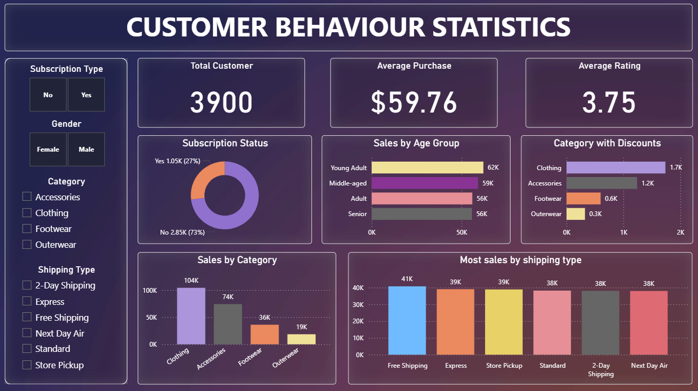

# CUSTOMER SHOPPING BEHAVIOUR ANALYSIS DASHBOAD

## Project Overview
This interactive Power BI dashboard provides an in-depth statistical analysis of customers shopping behaviour.
The main objective is to analyze customers shopping behaviour ,subscription type, product category, total sales, average review rating and discount applies etc.

## Project Objective
* Visualize the sales by category and subscription type.
* Identify the which gender is shopping more male or female.
* Which shipping method is more preferred by customers.
* Get the average purchase amount by age group.
* Which products are highly rated by reviewer.
* Which products are more likely to sold only with discount.

## Key KPIs
* Total Customers: 3,900
* Average Purchase Amount: 59.76
* Subscribed Customers: 1053 (27%)
* Unsubscribed Customers: 2847 (73%)
* Average Review Rating: 3.75
* Sales by category
* Sales by shipping type

## Analytical Questions Answered
* What is the total revenue genrated by the Male vs Female ?
* Which customers used a discount but still spent more than the average puurchase amount ?
* Which are the top 5 products with the highest average rating ?
* Compare the average purchase amount between Standard and Express shipping ?
* Do subscribed customers spend more ? Compare average spend and total revenue between subscribes and non-subscribers ?
* Which 5 products have the highest percentage of purchases with discount applied ?
* Segment customers into New, Returning and Loyal based on their total number of previous puchases and show the count of each segment ?
* What are the top 3 most purchased products with each category ?
* Are customers who are repeat buyers (more then 5 previous puchases) also likely to subscribe ?
* What us the revenue contribution of each age group ?

## Tools And Technologies
* Microsoft Power BI — for building the dashboard
* MySQL — as the dataset source
* Python — for Exploratory data analysis
 

## Process
* Imported the data into Jupyter Notebook.
* Performed exploratory data analysis.
* Imported dataset into Mysql database.
* Execute various queries to get usefull insights.
* Imported data into Power Bi.
* Created measures and visualization (bar chart, Donut chart, slicer) to summerize the customers details.
* Combined all the visuals into a single interactive dashboard.
* Created Reports using all the information.
* Created Presentation for easy explanation.

## Dashboard
Customer_Behaviour_Dashboard.png

## Project Insights
* Total Customers: 3,900.
* Gender ratio: Male - 2652
                Female - 1248
* Average Review Rating: 3.75.
* Top 3 products by category: Ranked top 3 most sold products by product category.
* Shipping Type: compared the each shipping type to eachother to find which is preferred by customers.
* Subscription type: Get the data of subscriber and non-subscribers.
* Findout which product is depended on discount.

## Conclusion
The customer shopping behaviour dashboard provides a comprehansive overview of customers shopping from online sites.It shows the average amount spend by customers and average review rating including the shipping type how the which shipping type customers prefer to ship thier purchased products,it also shows whether customers subscribe to the premium services or not. 
